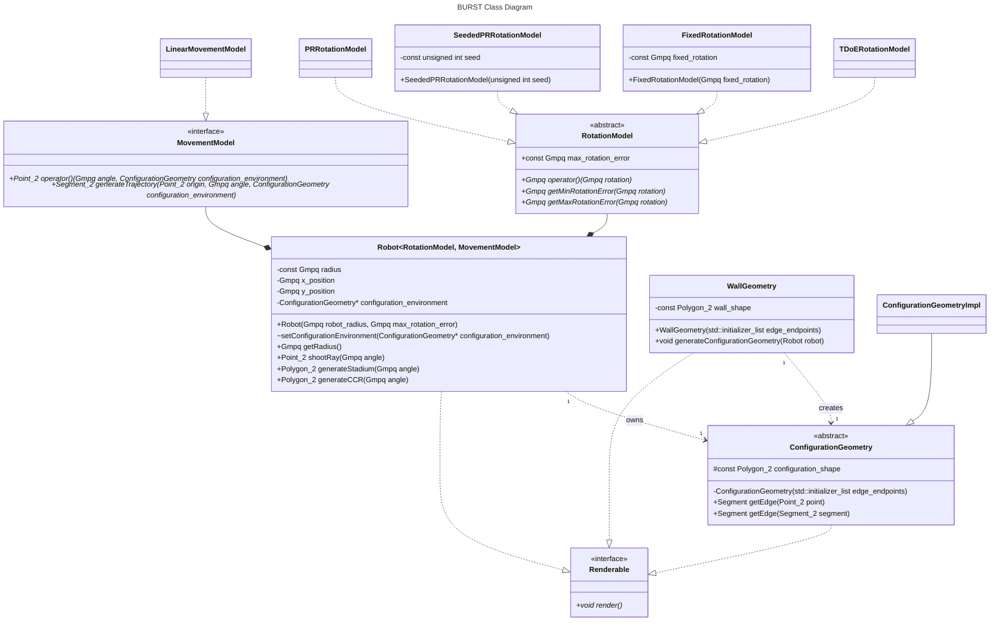

# BURST Design

BURST (Blind Unreliable Robot Simulation Tool) is a simulation framework based on the "Guaranteed Coverage with a Blind Robot" paper by Lewis, Feshbach, and O'Kane.
It's meant to simulate the behavior of a blind robot with (up to the implementation's discretion) unreliable movement and rotation.
The robot is "blind" in the sense that it has no sensors to perceive its environment save for a bumper that detects when it's hit a wall.

## Dependencies and Implementation

BURST is implemented in C++ and relies on CGAL 6.1.1 for computational geometry operations.
Qt is used for visualization purposes.

BURST is a header-only library.

## Class Diagram



> <p style="color: cyan; font-weight: bold;">NOTE:</p>
> The class diagram above explicitly uses CGAL types.
>
> Certain functions may be added or removed as the implementation progresses.

## Design Breakdown

### Renderable

The `Renderable` interface is implemented by any class that can be visualized.

### RotationModel

The `RotationModel` abstract class defines a functor that has a predefined maximum rotation error.
When the functor is called, it returns a new angle within the range:

```
[rotation - max_rotation_error, rotation + max_rotation_error]
```

There are 4 implementations of `RotationModel`:
* `PRRotationModel` - a policy that generates a pseudorandom rotation error.
* `SeededPRRotationModel` - a policy that generates a pseudorandom rotation error based on a seed.
* `FixedRotationModel` - a policy that always returns the same rotation error.
* `TDoERotationModel` - a policy that generates rotation errors based on the time signature changes in Dream Theater's "The Dance of Eternity".
  * This is a fun implementation that I'll add if I have time, but it's not a priority.

### MovementModel

The `MovementModel` interface defines a functor that generates:

* An endpoint for movement given an angle and a robot's configuration space.
* A trajectory for movement given an origin, angle, and robot's configuration space.

Currently, there's 1 implementation of `MovementModel`:
* `LinearMovementModel` - a policy that generates a straight line trajectory.

> <p style="color: cyan; font-weight: bold;">NOTE:</p>
> More implementations may be defined that create curved or nonlinear trajectories.
> This may result in the return type of the functor being changed.

### Robot

The `Robot` class is the main class of the simulation.
It represents a blind, unreliable robot that can move and rotate within a configuration space.
Currently, the robot is represented as a circle with a set radius.

The robot owns a configuration space (`ConfigurationGeometry`).
This configuration space is the total space the center of the robot can occupy without overlapping with any wall.
The robot utilizes this configuration space to perform raycasts and compute what regions it has covered.

The robot also owns a `RotationModel` and a `MovementModel` that determines how it rotates and moves, respectively.

### WallGeometry

The `WallGeometry` class represents the walls of the environment.
It's defined as a polygon the robot resides within.
The `WallGeometry` acts like a factory for the `ConfigurationGeometry`.
It generates `ConfigurationGeometry` based on the robot's shape and transferring ownership to the robot.

### ConfigurationGeometry

The `ConfigurationGeometry` abstract class represents the configuration space of the robot.
It's a polygon that represents the total space the center of the robot can occupy without overlapping with any wall.
It contains methods to get the edge of the configuration space polygon based on an intersection point or line segment.

The `ConfigurationGeometry` is an abstract class because it should neer be directly instantiated.

#### ConfigurationGeometryImpl

The `ConfigurationGeometryImpl` class is a concrete implementation of `ConfigurationGeometry`.
Its sole purpose is to be instantiated by the `WallGeometry` class, although `WallGeometry` gives a pointer to the base `ConfigurationGeometry` class to the robot.

## Considerations

* The above diagram omits the use of smart pointers for clarity.
* CGAL is GPLv3, so BURST will need to be GPLv3 if we go ahead and use CGAL.
* Alternatively, we could use the Shapely Python library for computational geometry.
This is BSD-3 licensed but is slower and more inaccurate than CGAL.
