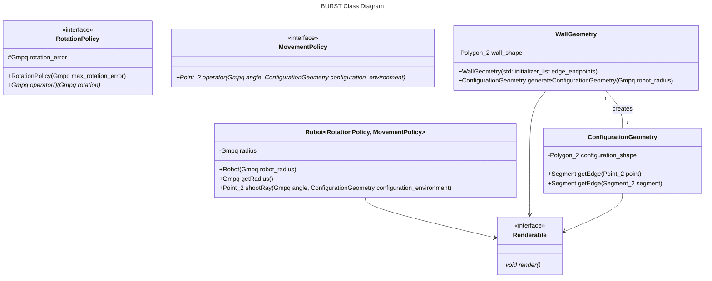

# BURST Design

BURST (Blind Unreliable Robot Simulation Tool) is a simulation framework based on the "Guaranteed Coverage with a Blind Robot" paper by Lewis, Feshbach, and O'Kane.
It's meant to simulate the behavior of a blind robot with (up to the implementation's discretion) unreliable movement and rotation.
The robot is "blind" in the sense that it has no sensors to perceive its environment save for a bumper that detects when it's hit a wall.

## Dependencies and Implementation

BURST is implemented in C++ and relies on CGAL 6.1.1 for computational geometry operations.
Qt is used for visualization purposes.

BURST is a header-only library.

## Class Diagram

## Considerations

CGAL is GPLv3, so BURST will need to be GPLv3 if we go ahead and use CGAL.
