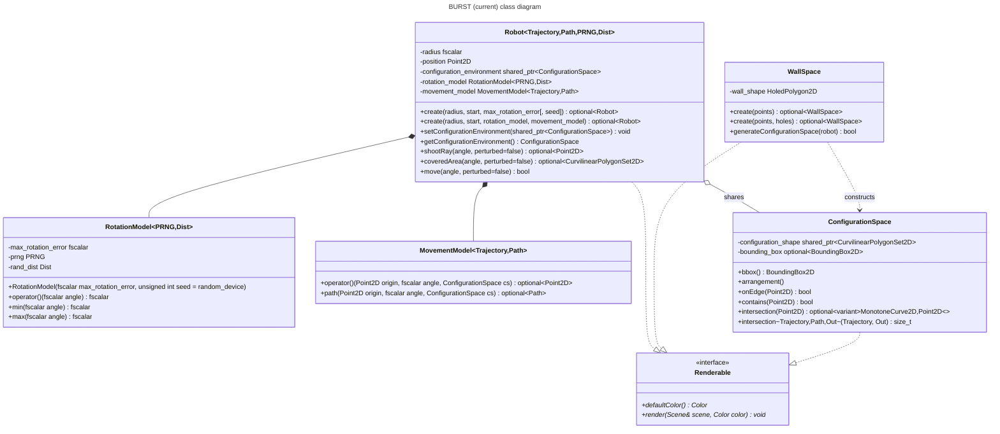

# BURST Design

BURST (Blind Unreliable Robot Simulation Tool) is a C++20 library for simulating a **blind** circular robot moving in a 2D polygonal environment, inspired by “Guaranteed Coverage with a Blind Robot” (Lewis, Feshbach, O’Kane). “Blind” here means the robot does not sense its surroundings beyond **contact with the boundary** (modelled geometrically as motion constrained to the configuration-space boundary).

This document describes the **current** library design as implemented in `include/BURST/*.hpp`.

## Implementation and dependencies

BURST is implemented as a **header-only** library distributed as a CMake **INTERFACE** target (`BURST`). Consumers include headers from `include/` and link to the `BURST` target to inherit transitive dependencies.

- **C++**: C++20
- **Geometry**: CGAL (Exact predicates / exact constructions kernel with sqrt; general polygon set operations)
- **Rendering**: CGAL basic viewer / graphics scene (transitively uses Qt6 in typical CGAL builds)
- **Other**: Boost (header components), MPFR (via Boost.Multiprecision MPFR backend)

## Public headers (module map)

The current public surface is:

- `BURST/kernel.hpp`: CGAL kernel + traits (`Kernel`, `LinearTraits`, `CurvedTraits`)
- `BURST/numeric.hpp`: scalar types (`numeric::fscalar`, `numeric::hpscalar`) and conversion helpers
- `BURST/geometry.hpp`: 2D geometry type aliases + helpers (polygon construction, circles, point conversion, rendering adapters)
- `BURST/renderable.hpp`: `renderable::Renderable` interface + `renderable::render_all`
- `BURST/models.hpp`: motion noise models (`models::RotationModel`, `models::MovementModel`)
- `BURST/wall_space.hpp`: environment geometry (`geometry::WallSpace`)
- `BURST/configuration_space.hpp`: free-space boundary for the robot center (`geometry::ConfigurationSpace`)
- `BURST/robot.hpp`: the robot (`Robot<...>`)
- `BURST/logging.hpp`: `BURST_ERROR` / `BURST_WARNING` macros

## Core concepts and data flow

At a high level:

1. Build a `geometry::WallSpace` from an outer polygon (and optional hole polygons).
2. Create a `Robot<...>` with radius and a starting point.
3. Ask the wall to generate a `geometry::ConfigurationSpace` for the robot (inset of the outer boundary, offset of holes), then assign it to the robot.
4. Use the robot’s movement queries:
   - `shootRay(angle)`: compute the next boundary hit in a direction
   - `coveredArea(angle)`: compute the “stadium” region swept by a move (start/end discs + path envelope)
   - `move(angle)`: update position to the computed endpoint (if valid)

The implementation heavily relies on CGAL polygon-set and arrangement operations, using exact geometry types for robustness.

## Class diagram (current)


```mermaid
---
title: BURST (current) class diagram
---
classDiagram
    direction TD

    class Renderable {
        <<interface>>
        +defaultColor() Color*
        +render(Scene& scene, Color color) void*
    }

    class RotationModel~PRNG,Dist~ {
        -max_rotation_error fscalar
        -prng PRNG
        -rand_dist Dist
        +RotationModel(fscalar max_rotation_error, unsigned int seed = random_device)
        +operator()(fscalar angle) fscalar
        +min(fscalar angle) fscalar
        +max(fscalar angle) fscalar
    }

    class MovementModel~Trajectory,Path~ {
        +operator()(Point2D origin, fscalar angle, ConfigurationSpace cs) optional~Point2D~
        +path(Point2D origin, fscalar angle, ConfigurationSpace cs) optional~Path~
    }

    class ConfigurationSpace {
        -configuration_shape shared_ptr~CurvilinearPolygonSet2D~
        -bounding_box optional~BoundingBox2D~
        +bbox() BoundingBox2D
        +arrangement()
        +onEdge(Point2D) bool
        +contains(Point2D) bool
        +intersection(Point2D) optional~variant~MonotoneCurve2D,Point2D~~
        +intersection~Trajectory,Path,Out~(Trajectory, Out) size_t
    }
    ConfigurationSpace ..|> Renderable

    class WallSpace {
        -wall_shape HoledPolygon2D
        +create(points) optional~WallSpace~
        +create(points, holes) optional~WallSpace~
        +generateConfigurationSpace(robot) bool
    }
    WallSpace ..|> Renderable
    WallSpace ..> ConfigurationSpace : constructs

    class Robot~Trajectory,Path,PRNG,Dist~ {
        -radius fscalar
        -position Point2D
        -configuration_environment shared_ptr~ConfigurationSpace~
        -rotation_model RotationModel~PRNG,Dist~
        -movement_model MovementModel~Trajectory,Path~
        +create(radius, start, max_rotation_error[, seed]) optional~Robot~
        +create(radius, start, rotation_model, movement_model) optional~Robot~
        +setConfigurationEnvironment(shared_ptr~ConfigurationSpace~) void
        +getConfigurationEnvironment() ConfigurationSpace
        +shootRay(angle, perturbed=false) optional~Point2D~
        +coveredArea(angle, perturbed=false) optional~CurvilinearPolygonSet2D~
        +move(angle, perturbed=false) bool
    }
    Robot ..|> Renderable
    Robot o-- ConfigurationSpace : shares
    Robot *-- RotationModel
    Robot *-- MovementModel
```

## Design details

### `renderable::Renderable`

Anything that can be visualized implements `renderable::Renderable` (currently: `geometry::WallSpace`, `geometry::ConfigurationSpace`, and `Robot<...>`). Rendering is performed into a `CGAL::Graphics_scene`; `renderable::render_all(...)` provides a simple way to draw multiple objects back-to-front.

### `models::RotationModel`

`models::RotationModel<PRNG, Dist>` is a lightweight value type (no inheritance) that perturbs an angle by sampling a scalar in \([-1, 1]\) and scaling by `max_rotation_error`. It also provides `min(angle)` / `max(angle)` bounds for worst-case reasoning.

The robot can use:

- **nominal** motion: `perturbed=false` (angles used as provided)
- **noisy** motion: `perturbed=true` (angles passed through the rotation model)

### `models::MovementModel`

`models::MovementModel<Trajectory, Path>` encodes “how to advance” from a boundary point at a given direction:

- It constructs a `Trajectory` (e.g., a ray) from the robot’s current position and direction.
- It intersects the trajectory with the configuration-space boundary and picks the **closest** valid intersection.
- It rejects outward-pointing trajectories by checking that the midpoint between origin and endpoint lies inside the configuration space.

This design keeps the “movement semantics” separate from the robot state and supports alternative path/trajectory representations via templates.

### `geometry::WallSpace`

`geometry::WallSpace` represents the environment boundary as a polygon-with-holes.

Key responsibilities:

- **Validation**: `WallSpace::create(...)` rejects degenerate/self-intersecting inputs (outer boundary must be simple; holes must be valid and non-intersecting).
- **Configuration space generation**: `generateConfigurationSpace(robot)` computes the free-space for the robot’s **center** by offsetting the walls by the robot radius (inset of the outer boundary; offset of holes) and assigning the result to the robot.

### `geometry::ConfigurationSpace`

`geometry::ConfigurationSpace` is the configuration-space boundary for the robot center. It is **not** directly constructible from the public API; it’s created by `WallSpace` and stored/owned via `std::shared_ptr`.

Key operations:

- `onEdge(point)`: whether a point lies on the boundary (important invariant for motion)
- `contains(point)`: whether a point lies in the free space (including boundary)
- `intersection(trajectory, out_it)`: compute boundary intersections for a given trajectory/path pair

### `Robot<...>`

`Robot` is a templated value type:

```text
Robot<Trajectory, Path, PRNG, Dist>
```

It owns:

- **Geometry/state**: radius + current center position
- **Models**: `RotationModel<PRNG,Dist>` and `MovementModel<Trajectory,Path>`
- **Environment**: a `shared_ptr<geometry::ConfigurationSpace>`

Construction is via `Robot::create(...)` which returns `std::optional<Robot>` to enforce preconditions (e.g., positive radius) without throwing.

## Error handling and diagnostics

Most “invalid geometry / invalid motion” outcomes are communicated as:

- `std::nullopt` (for queries like `shootRay` / `coveredArea`)
- `false` (for actions like `move` / `generateConfigurationSpace`)

Diagnostic messages are emitted through `BURST_ERROR(...)` / `BURST_WARNING(...)` macros (which can be compiled out via `BURST_DISABLE_ERRORS` / `BURST_DISABLE_WARNINGS`).

## Notes / constraints

- **Exact arithmetic**: The default kernel is exact (with sqrt), and many conversions go through string-based formatting to preserve precision; this trades performance for robustness.
- **Licensing**: This repository currently ships with **GPLv3** (`LICENSE`). CGAL is linked as a dependency; the project’s licensing should be treated accordingly.
